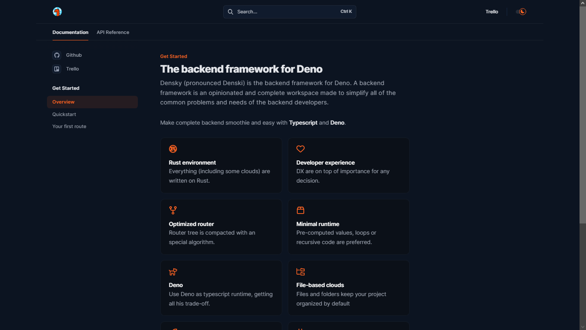

# Densky Documentation



## Development

This documentation is made with Mintlify, so you need to install their [CLI](https://www.npmjs.com/package/mintlify) to preview the documentation changes locally. You can install it via:

```bash
npm i -g mintlify
# With volta:
volta install mintlify
```

Run the following command at the root:

```bash
mintlify dev
```

## Contribute

The contribution must follow the following rules:

- `Be clear` Any confuse on your writing may cause a problem, please avoid them.
- `Discussion -> Issue -> PR` Try to follow this roadmap for any feature purpose. If you found a bug or misspelling, you may skip the discussion step and go directly to opening an issue.
- `Check spelling` We're humans, so you should use some language tool to avoid misspelling.

The route tree is writing with a code block and `diff` highlight:
```
\`\`\`diff
  routes
+ | _index.ts
\`\`\`
```

> Indent is `|` and one space.


#### Troubleshooting

- Mintlify dev isn't running - Run `mintlify install` it'll re-install dependencies.
- Page loads as a 404 - Make sure you are running in a folder with `mint.json`
